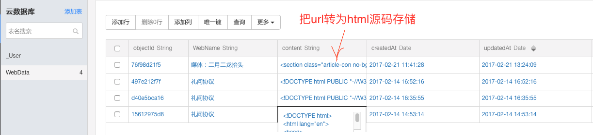
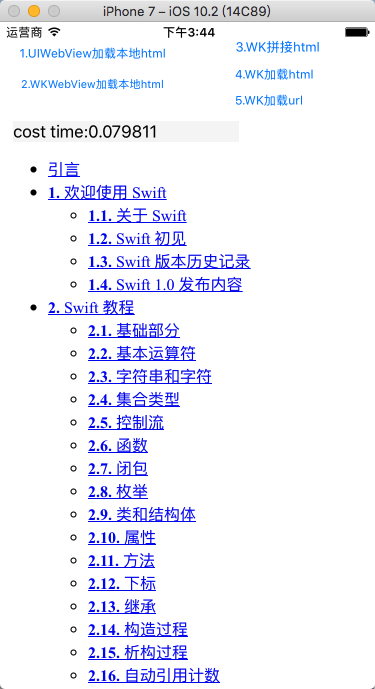

# ManyWaysLoadHtml
对比UIWebView/WKWebView加载本地html文件，加载url，加载拼接本地的html源码，直接加载源码等方式时间消耗

#简介
>使用bmob云服务器测试存储html源码,请求html源码来模拟请求服务器数据。
存储如下：

5中加载方式如下：

- 方法1.
//读取本地html文件方式：UIWebview

- 方法2.
//读取本地html文件方式：  WKWebView

- 方法3.
//通过本地放两部分（大部分）源码，拼接部分网络请求源码
这里用到两个文件，相当于完整html分三段，头和尾不变的存放在本地，只有少量中间变化的放在服务器，取下来拼接成完整的，测试这种方法比直接加载url要快很多，比获取完整html文件要内存省很多。

- 方法4.
//WKWebview直接读取html

- 方法5.
//WKWebview读取url

截图

